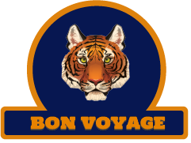

# Bon Voyage



> A project developed for CSEDU.

---

### Table of Contents

- **[Description](#description)**
- **[How To Use](#how-to-use)**

  - _[Installation](#installation)_
  - _[Build and Run](#Build-and-Run)_

- **[References](#references)**
- **[License](#license)**
- **[Author Info](#author-info)**

---

## Description

“Bon Voyage" is an epic adventure game that takes a player on a journey to two most daunting, haunting and magnificently beautiful places. A player can choose to go on an adventure to the largest Mangrove forest Sundarban or can choose to visit the fantasy land Winterfell from the most coveted tv show of the century The Game of Thrones.

#### Programming Languages

- C
- C++

#### Libraries

- SDL
- SDL2

[Back To The Top](#BonVoyage)

---

## How To Use

### **Installation**

#### **SDL2 Library**

```console
$ sudo apt-get install libsdl2-dev
```

##### **Additional SDL2 Libraries :**

- ##### SDL Image

```console
$ sudo apt-get install libsdl2-image-dev
```

- ##### SDL Font

```console
$ sudo apt-get install libsdl2-ttf-dev
```

- ##### SDL Mixer

```console
$ sudo apt-get install libsdl2-mixer-2.0-0
```

### **Build and Run**

From the directory of BonVoyage open your terminal and run the following Command

```console
$ make && ./play
```

[Back To The Top](#BonVoyage)

---

## References

- [Lazyfoo SDL Tutorials](https://lazyfoo.net/tutorials/SDL/index.php)
- [SDL Wiki](https://wiki.libsdl.org/Tutorials)

[Back To The Top](#BonVoyage)

## Author Info

- Fahmida Ara - [@fahmidareem3](https://github.com/fahmidareem3)
- Shahriar Rumel - [@Shahriar-Rumel](https://github.com/Shahriar-Rumel)
- Ahnaf Tahmid - [@AhnafTahmidie](https://github.com/AhnafTahmidie)

[Back To The Top](#BonVoyage)
